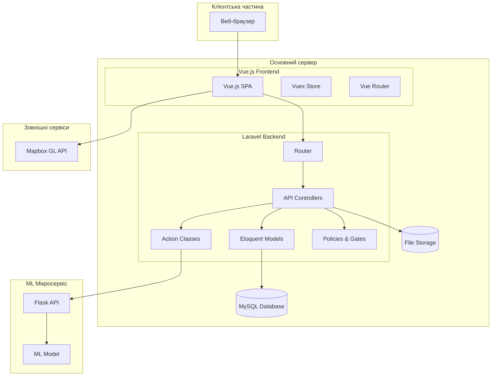
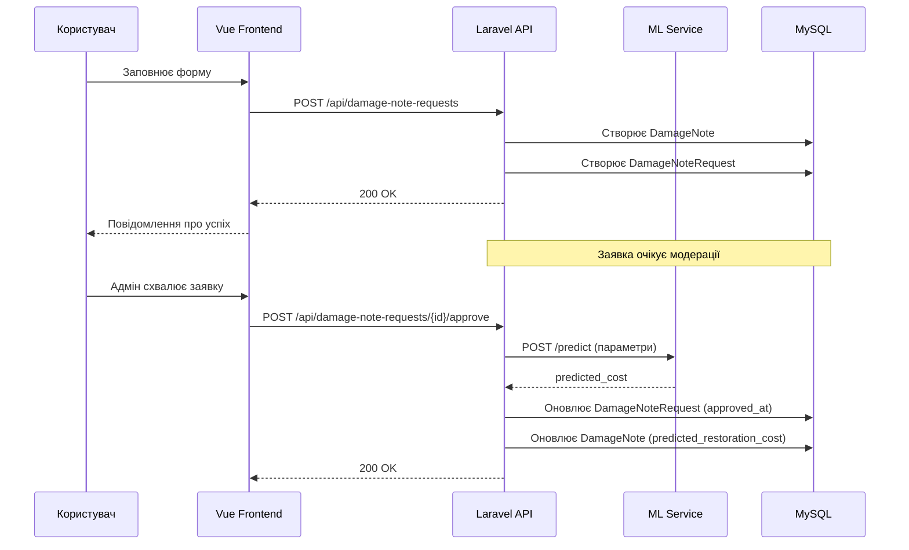
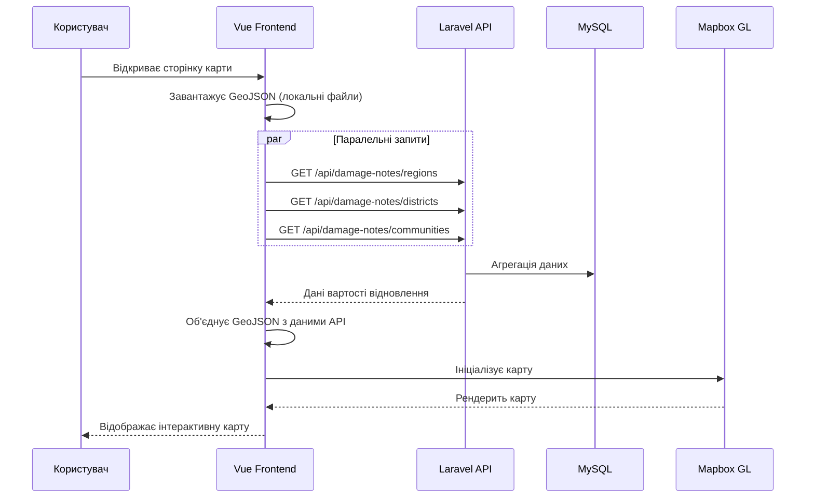
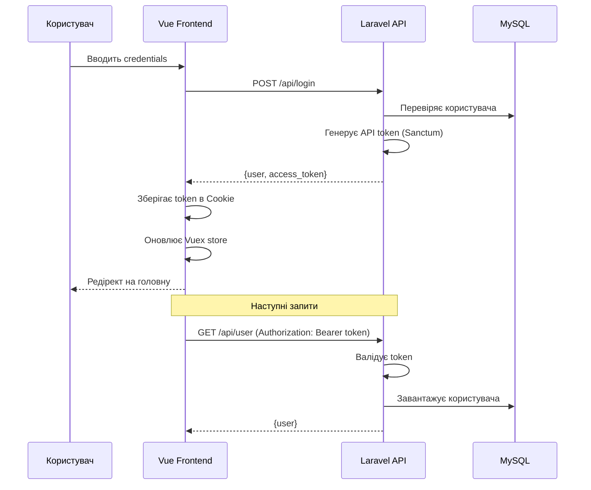
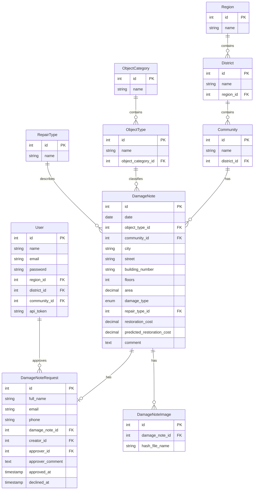

# Архітектура інформаційної системи "Damage Map"

## 1. Загальний огляд архітектури

### 1.1. Архітектурний патерн

Система "Damage Map" побудована за **гібридною архітектурою**, що поєднує:

- **Монолітний веб-застосунок** — основна частина системи, реалізована як Laravel + Vue.js SPA (Single Page Application)
- **Мікросервіс машинного навчання** — окремий Python/Flask сервіс для прогнозування вартості відновлення

Такий підхід забезпечує:
- Простоту розгортання та підтримки основного застосунку
- Незалежне масштабування та оновлення ML-компоненту
- Можливість використання спеціалізованих технологій для кожного компоненту

### 1.2. Високорівнева діаграма архітектури



## 2. Компоненти системи

### 2.1. Laravel Backend

#### 2.1.1. Структура каталогів

```
app/
├── Actions/                    # Класи бізнес-логіки
│   ├── PredictRestorationCostAction.php
│   └── PredictRestorationCostExplainAction.php
├── Exceptions/                 # Кастомні виключення
│   └── UpstreamRequestException.php
├── Helpers/                    # Допоміжні класи
│   └── Tokenable.php
├── Http/
│   ├── Controllers/
│   │   └── Api/               # API контролери
│   │       ├── Auth/
│   │       │   └── AuthController.php
│   │       ├── CommunitiesController.php
│   │       ├── DamageNotesController.php
│   │       ├── DamageNoteRequestsController.php
│   │       ├── ObjectTypesController.php
│   │       ├── RegionsController.php
│   │       ├── RegulationDocumentsController.php
│   │       ├── RepairTypesController.php
│   │       ├── RestorationCostController.php
│   │       ├── RolesController.php
│   │       ├── StatisticsController.php
│   │       ├── UsersController.php
│   │       └── VirtualToursController.php
│   ├── Middleware/            # Middleware
│   └── Requests/              # Form Request класи валідації
├── Models/                    # Eloquent моделі
│   ├── Community.php
│   ├── DamageNote.php
│   ├── DamageNoteImage.php
│   ├── DamageNoteRequest.php
│   ├── District.php
│   ├── ObjectCategory.php
│   ├── ObjectType.php
│   ├── InflationIndex.php
│   ├── Region.php
│   ├── RegulationDocument.php
│   ├── RepairType.php
│   ├── User.php
│   └── VirtualTour.php
├── Policies/                  # Політики авторизації
└── Providers/
    └── AuthServiceProvider.php
```

#### 2.1.2. Патерни проєктування

**Action Pattern**
Для інкапсуляції складної бізнес-логіки використовується патерн Action:

```php
// app/Actions/PredictRestorationCostAction.php
class PredictRestorationCostAction
{
    public function execute(array $data): array
    {
        // Підготовка даних
        // HTTP-запит до Flask API
        // Обробка відповіді
        return ['predicted_cost' => $cost];
    }
}
```

**Repository Pattern (неявний)**
Laravel Eloquent ORM виконує функції репозиторію, забезпечуючи абстракцію доступу до даних.

**Form Request Validation**
Валідація вхідних даних винесена в окремі класи:

```
app/Http/Requests/
├── DamageNotes/
│   ├── GetApproved.php
│   ├── GetNotApproved.php
│   ├── Show.php
│   ├── Store.php
│   ├── Update.php
│   └── Destroy.php
├── Statistics/
│   ├── ShowGlobal.php
│   ├── ShowRatio.php
│   └── ShowCube.php
└── ...
```

### 2.2. Vue.js Frontend

#### 2.2.1. Структура каталогів

```
resources/js/
├── app.js                     # Точка входу
├── App.vue                    # Кореневий компонент
├── bootstrap.js               # Ініціалізація
├── router/
│   ├── index.js              # Конфігурація маршрутів
│   └── middlewares/
│       └── global-middleware.js
├── store/
│   ├── index.js              # Vuex store
│   ├── state.js              # Початковий стан
│   ├── getters.js            # Геттери
│   ├── mutations.js          # Мутації
│   └── actions.js            # Асинхронні дії
├── layouts/
│   ├── DefaultLayout.vue     # Основний layout з навігацією
│   └── BlankLayout.vue       # Layout для авторизації
├── pages/                    # Сторінки
│   ├── Map.vue
│   ├── Statistics.vue
│   ├── CubeStatistics.vue
│   ├── ApprovedDamageNotes.vue
│   ├── NotApprovedDamageNotes.vue
│   ├── CreateDamageNote.vue
│   ├── EditDamageNote.vue
│   ├── PreviewDamageNote.vue
│   ├── Users.vue
│   ├── CreateUser.vue
│   ├── EditUser.vue
│   ├── Login.vue
│   ├── RegulationDocuments.vue
│   ├── CreateRegulationDocument.vue
│   └── virtual-tours/
│       ├── VirtualTours.vue
│       ├── CreateVirtualTour.vue
│       ├── PreviewVirtualTour.vue
│       └── PreviewVirtualTours.vue
├── components/
│   ├── charts/               # Компоненти графіків
│   │   ├── BarChart.vue
│   │   ├── LineChart.vue
│   │   ├── PieChart.vue
│   │   └── DoughnutChart.vue
│   ├── statistics/           # Компоненти статистики
│   │   ├── GlobalStatistics.vue
│   │   ├── RatioStatistics.vue
│   │   └── StatisticsTopLevelFilters.vue
│   ├── cube-statistics/      # OLAP компоненти
│   │   ├── Cube.vue
│   │   └── CubeStatisticsTopLevelFilters.vue
│   ├── damage-note/
│   │   └── tabs/             # Вкладки деталей пошкодження
│   │       ├── DamageNoteGeneralInfo.vue
│   │       ├── DamageNoteGallery.vue
│   │       ├── DamageNoteFinancing.vue
│   │       └── DamageNoteRestorationCost.vue
│   ├── virtual-tour/         # Компоненти віртуальних турів
│   │   ├── VirtualTourContentBuilder.vue
│   │   ├── VirtualTourContentBuilder3d.vue
│   │   ├── VirtualTourContentBuilderImage.vue
│   │   ├── VirtualTourContentBuilderSlider.vue
│   │   └── VirtualTourContentBuilderText.vue
│   ├── dialogs/              # Діалогові вікна
│   │   ├── ConfirmDialog.vue
│   │   ├── ApproveRequestDialog.vue
│   │   └── DeclineRequestDialog.vue
│   ├── DamageForm.vue        # Форма пошкодження
│   ├── UserForm.vue          # Форма користувача
│   └── RegulationDocumentForm.vue
└── data/                     # GeoJSON дані для карти
    ├── regions.json
    ├── districts.json
    ├── district-titles.json
    ├── communities.json
    └── community-titles.json
```

### 2.3. Python ML Мікросервіс

#### 2.3.1. Призначення

Зовнішній Flask-сервіс для прогнозування вартості відновлення на основі моделі машинного навчання.

#### 2.3.2. API Інтерфейс

```
POST /predict          — базовий прогноз
POST /predict_explain  — прогноз із внесками ознак (SHAP/LIME)
Content-Type: application/json
X-API-Key: {api_key}

Request:
{
    "area": 150.5,
    "floors": 3,
    "building_type": "Житловий будинок",
    "damage_level": "Середнє",
    "region": "Харківська",
    "repair_type": "Капітальний ремонт",
    "work_year": 2026,
    "work_month": 4,
    "inflation_indices": [
        { "year": 2022, "month": 1, "index_value": 0.75 },
        { "year": 2024, "month": 1, "index_value": 1.0 },
        ...
    ]
}

Response (/predict):
{
    "predicted_cost": 1250000.00,
    "adjusted_cost": 1550000.00,
    "inflation_k": 1.24,
    "base_year": 2024,
    "base_month": 1,
    "work_year": 2026,
    "work_month": 4,
    "currency": "UAH",
    "model": "gradient_boosting_v2"
}
```

**Примітка щодо `inflation_indices`:** Laravel передає повний список коефіцієнтів з таблиці `inflation_indices` через `InflationIndex::getAllForPayload()` (кеш 60 хв). Flask використовує ці значення замість власного вбудованого словника. Якщо поле відсутнє — Flask повертається до власних значень.

#### 2.3.3. Конфігурація

Налаштування з'єднання зберігаються в `config/services.php`:

```php
'restoration' => [
    'url' => env('PY_PREDICT_URL', 'http://127.0.0.1:5000'),
    'api_key' => env('PY_API_KEY'),
    'timeout' => env('PY_TIMEOUT', 8),
],
```

## 3. Потоки даних

### 3.1. Потік створення запису про пошкодження



### 3.2. Потік завантаження карти



### 3.3. Потік автентифікації



## 4. Модель даних

### 4.1. ER-діаграма основних сутностей



### 4.2. Зв'язки між моделями

| Модель | Зв'язок | Пов'язана модель | Тип |
|--------|---------|------------------|-----|
| Region | hasMany | District | 1:N |
| District | belongsTo | Region | N:1 |
| District | hasMany | Community | 1:N |
| Community | belongsTo | District | N:1 |
| ObjectCategory | hasMany | ObjectType | 1:N |
| ObjectType | belongsTo | ObjectCategory | N:1 |
| DamageNote | belongsTo | ObjectType | N:1 |
| DamageNote | belongsTo | Community | N:1 |
| DamageNote | belongsTo | RepairType | N:1 |
| DamageNote | hasOne | DamageNoteRequest | 1:1 |
| DamageNote | hasMany | DamageNoteImage | 1:N |
| DamageNoteRequest | belongsTo | DamageNote | N:1 |

## 5. Безпека та авторизація

### 5.1. Автентифікація

Система використовує **Laravel Sanctum** для API автентифікації:

- Token-based автентифікація для SPA
- Токени зберігаються в cookies на клієнті
- Термін дії токена: 1 година (без "Remember me") або 1 рік (з "Remember me")

### 5.2. Авторизація

Авторизація реалізована через **Spatie Laravel Permission**:

```php
// Ролі
- super_admin
- admin
- analyst

// Перевірка в AuthServiceProvider
Gate::before(function ($user, $ability) {
    return $user->isSuperAdmin() ? true : null;
});
```

### 5.3. Територіальні обмеження

Адміністратори обмежені територіально через поля в моделі User:
- `region_id` — доступ до регіону
- `district_id` — доступ до району
- `community_id` — доступ до громади

```php
// Приклад фільтрації в контролері
$query->when(isset($user->region_id), function($query) use (&$user) {
    $query->where('districts.region_id', '=', $user->region_id);
});
```

## 6. Технологічний стек

### 6.1. Backend

| Технологія | Версія | Призначення |
|------------|--------|-------------|
| PHP | 8.x | Мова програмування |
| Laravel | 9.x | PHP Framework |
| Laravel Sanctum | - | API автентифікація |
| Spatie Permission | - | RBAC авторизація |
| F9Web API Response | - | Стандартизація API відповідей |
| PhpSpreadsheet | - | Імпорт Excel файлів |

### 6.2. Frontend

| Технологія | Версія | Призначення |
|------------|--------|-------------|
| Vue.js | 2.x | JavaScript Framework |
| Vuex | 3.x | State Management |
| Vue Router | 3.x | Client-side Routing |
| Vuetify | 2.x | UI Component Library |
| Element UI | - | Додаткові UI компоненти |
| Vuelidate | - | Валідація форм |
| Mapbox GL JS | - | Інтерактивні карти |
| Chart.js | - | Графіки та діаграми |
| Axios | - | HTTP клієнт |
| Moment.js | - | Робота з датами |

### 6.3. ML Мікросервіс

| Технологія | Призначення |
|------------|-------------|
| Python | Мова програмування |
| Flask | Web Framework |
| scikit-learn / XGBoost | ML бібліотеки |

### 6.4. Інфраструктура

| Компонент | Технологія |
|-----------|------------|
| База даних | MySQL |
| Веб-сервер | Apache/Nginx |
| Збірка фронтенду | Laravel Mix (Webpack) |
| Картографія | Mapbox GL |

## 7. Обґрунтування архітектурних рішень

### 7.1. Вибір монолітної архітектури для основного застосунку

**Переваги:**
- Простота розробки та розгортання
- Менші операційні витрати
- Єдина кодова база для backend та API
- Достатня продуктивність для очікуваного навантаження

**Обмеження:**
- Вертикальне масштабування
- Єдина точка відмови

### 7.2. Виокремлення ML-сервісу

**Обґрунтування:**
- Незалежний цикл розробки ML-моделі
- Використання Python екосистеми для ML
- Можливість незалежного масштабування
- Ізоляція ресурсомістких обчислень

### 7.3. Вибір SPA архітектури

**Переваги:**
- Покращений UX через відсутність перезавантажень
- Ефективна робота з інтерактивною картою
- Кешування статичних ресурсів
- Чіткий поділ frontend/backend

### 7.4. Використання Vuex для state management

**Обґрунтування:**
- Централізоване сховище стану фільтрів
- Спрощення обміну даними між компонентами
- Зберігання стану автентифікації
- Передбачувана зміна стану

## 8. Висновки

Архітектура системи "Damage Map" є збалансованим рішенням, що поєднує:

1. **Простоту** монолітного підходу для основного застосунку
2. **Гнучкість** мікросервісної архітектури для ML-компоненту
3. **Сучасний UX** завдяки SPA архітектурі з Vue.js
4. **Надійну безпеку** через Laravel Sanctum та Spatie Permission
5. **Ефективну візуалізацію** з використанням Mapbox GL

Обрана архітектура забезпечує баланс між складністю розробки, продуктивністю та масштабованістю, що є оптимальним для даного типу інформаційної системи.
