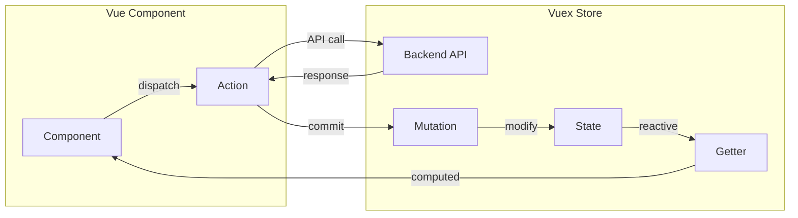

# Архітектура Frontend-частини системи "Damage Map"

## 1. Загальний огляд

### 1.1. Технологічний стек

| Технологія | Версія | Призначення |
|------------|--------|-------------|
| Vue.js | 2.x | Основний JavaScript фреймворк |
| Vuex | 3.x | Централізоване управління станом |
| Vue Router | 3.x | Клієнтська маршрутизація |
| Vuetify | 2.x | UI компонентна бібліотека (Material Design) |
| Element UI | - | Додаткові UI компоненти |
| Vuelidate | - | Валідація форм |
| Mapbox GL JS | - | Інтерактивні карти |
| Chart.js | - | Візуалізація даних (графіки) |
| Axios | - | HTTP клієнт |
| Moment.js | - | Робота з датами та часом |
| Laravel Mix | - | Збірка та компіляція ресурсів |

### 1.2. Архітектурний патерн

Frontend реалізовано як **Single Page Application (SPA)** з використанням:

- **Компонентного підходу** — інтерфейс побудований з ієрархії Vue-компонентів
- **Flux-подібного патерну** — Vuex для управління глобальним станом
- **Клієнтської маршрутизації** — Vue Router для навігації без перезавантаження сторінки

## 2. Структура проєкту

### 2.1. Файлова організація

```
resources/
├── js/
│   ├── app.js                     # Головна точка входу
│   ├── App.vue                    # Кореневий Vue компонент
│   ├── bootstrap.js               # Ініціалізація бібліотек
│   │
│   ├── router/                    # Маршрутизація
│   │   ├── index.js              # Конфігурація маршрутів
│   │   └── middlewares/
│   │       └── global-middleware.js  # Глобальні guards
│   │
│   ├── store/                     # Vuex сховище
│   │   ├── index.js              # Конфігурація store
│   │   ├── state.js              # Початковий стан
│   │   ├── getters.js            # Обчислювані властивості
│   │   ├── mutations.js          # Синхронні мутації
│   │   └── actions.js            # Асинхронні дії
│   │
│   ├── layouts/                   # Макети сторінок
│   │   ├── DefaultLayout.vue     # Основний макет з навігацією
│   │   └── BlankLayout.vue       # Макет для сторінок авторизації
│   │
│   ├── pages/                     # Сторінки (views)
│   │   ├── Map.vue               # Інтерактивна карта
│   │   ├── Statistics.vue        # Статистика
│   │   ├── CubeStatistics.vue    # OLAP-куб
│   │   ├── ApprovedDamageNotes.vue
│   │   ├── NotApprovedDamageNotes.vue
│   │   ├── CreateDamageNote.vue
│   │   ├── EditDamageNote.vue
│   │   ├── PreviewDamageNote.vue
│   │   ├── RegulationDocuments.vue
│   │   ├── CreateRegulationDocument.vue
│   │   ├── Users.vue
│   │   ├── CreateUser.vue
│   │   ├── EditUser.vue
│   │   ├── Login.vue
│   │   └── virtual-tours/        # Підкаталог для віртуальних турів
│   │       ├── VirtualTours.vue
│   │       ├── CreateVirtualTour.vue
│   │       ├── PreviewVirtualTour.vue
│   │       └── PreviewVirtualTours.vue
│   │
│   ├── components/                # Переиспользовувані компоненти
│   │   ├── charts/               # Графіки
│   │   ├── statistics/           # Компоненти статистики
│   │   ├── cube-statistics/      # Компоненти OLAP
│   │   ├── damage-note/          # Компоненти пошкоджень
│   │   ├── virtual-tour/         # Компоненти турів
│   │   ├── dialogs/              # Діалогові вікна
│   │   ├── DamageForm.vue        # Форма пошкодження
│   │   ├── UserForm.vue          # Форма користувача
│   │   ├── RegulationDocumentForm.vue
│   │   └── Slider.vue            # Слайдер зображень
│   │
│   └── data/                      # Статичні дані
│       ├── regions.json          # GeoJSON регіонів
│       ├── districts.json        # GeoJSON районів
│       ├── district-titles.json  # Центри районів
│       ├── communities.json      # GeoJSON громад
│       └── community-titles.json # Центри громад
│
├── sass/                          # SCSS стилі
│   └── app.scss                  # Головний файл стилів
│
└── views/                         # Blade шаблони
    └── app.blade.php             # Головний HTML шаблон
```

### 2.2. Аліаси шляхів

У конфігурації webpack.mix.js визначено аліас для спрощення імпортів:

```javascript
// webpack.mix.js
mix.webpackConfig({
    resolve: {
        alias: {
            '@': path.resolve(__dirname, 'resources')
        }
    }
});
```

**Використання:**
```javascript
import Map from '@/js/pages/Map.vue';
import regions from '@/js/data/regions.json';
```

## 3. Маршрутизація (Vue Router)

### 3.1. Конфігурація маршрутів

```javascript
// resources/js/router/index.js
const router = new VueRouter({
    mode: 'history',  // HTML5 History API
    routes: [
        {
            path: "/",
            component: () => import("@/js/layouts/DefaultLayout"),
            children: [
                // Публічні маршрути
                { path: "/", name: 'map', component: () => import("@/js/pages/Map") },
                { path: "statistics", name: "statistics", component: () => import("@/js/pages/Statistics") },
                { path: "cube-statistics", name: "cube-statistics", component: () => import("@/js/pages/CubeStatistics") },

                // Захищені маршрути (потребують автентифікації)
                {
                    path: "damage-notes/approved",
                    name: "damage-notes.approved",
                    component: () => import("@/js/pages/ApprovedDamageNotes"),
                    meta: { auth: true }
                },

                // Маршрути з обмеженням за роллю
                {
                    path: "users",
                    name: "users",
                    component: () => import("@/js/pages/Users"),
                    meta: { roles: ['super_admin'] }
                },
                // ...
            ]
        },
        {
            path: "/auth",
            component: () => import("@/js/layouts/BlankLayout"),
            children: [
                {
                    path: "login",
                    name: "auth.login",
                    component: () => import("@/js/pages/Login"),
                    meta: { guest: true }  // Тільки для неавторизованих
                }
            ]
        }
    ]
});
```

### 3.2. Метадані маршрутів

| Мета-поле | Тип | Опис |
|-----------|-----|------|
| `auth` | boolean | Потребує автентифікації |
| `guest` | boolean | Тільки для гостей (неавторизованих) |
| `roles` | string[] | Дозволені ролі |

### 3.3. Navigation Guards

```javascript
// resources/js/router/middlewares/global-middleware.js
export default function globalMiddleware(router) {
    router.beforeEach(async (to, from, next) => {
        const store = router.app.$store;
        const isAuthorized = store.getters.isAuthorized;
        const currentUser = store.state.currentUser;

        // Завантаження користувача якщо є токен
        if (isAuthorized && !currentUser) {
            try {
                await store.dispatch('loadCurrentUser');
            } catch (e) {
                // Токен невалідний
                store.commit('setToken', null);
                Cookies.remove('access_token');
            }
        }

        // Перевірка автентифікації
        if (to.meta.auth && !isAuthorized) {
            return next({ name: 'auth.login' });
        }

        // Перевірка "тільки для гостей"
        if (to.meta.guest && isAuthorized) {
            return next({ name: 'map' });
        }

        // Перевірка ролей
        if (to.meta.roles && to.meta.roles.length > 0) {
            const userRoles = currentUser?.roles?.map(r => r.name) || [];
            const hasRole = to.meta.roles.some(role => userRoles.includes(role));

            if (!hasRole) {
                return next({ name: 'map' });
            }
        }

        next();
    });
}
```

### 3.4. Таблиця маршрутів

| Шлях | Назва | Компонент | Доступ |
|------|-------|-----------|--------|
| `/` | map | Map.vue | Публічний |
| `/statistics` | statistics | Statistics.vue | Публічний |
| `/cube-statistics` | cube-statistics | CubeStatistics.vue | Публічний |
| `/damage-notes/create` | damage-notes.create | CreateDamageNote.vue | Публічний |
| `/damage-notes/approved` | damage-notes.approved | ApprovedDamageNotes.vue | auth |
| `/damage-notes/not-approved` | damage-notes.not-approved | NotApprovedDamageNotes.vue | auth |
| `/damage-notes/:id/edit` | damage-notes.edit | EditDamageNote.vue | admin, super_admin |
| `/damage-notes/:id/preview` | damage-notes.preview | PreviewDamageNote.vue | admin, super_admin |
| `/regulation-documents` | regulation-documents | RegulationDocuments.vue | Публічний |
| `/regulation-documents/create` | regulation-documents.create | CreateRegulationDocument.vue | super_admin |
| `/virtual-tours` | virtual-tours | VirtualTours.vue | super_admin |
| `/virtual-tours/preview` | virtual-tours.preview | PreviewVirtualTours.vue | Публічний |
| `/virtual-tours/:id/preview` | virtual-tours.tour.preview | PreviewVirtualTour.vue | Публічний |
| `/virtual-tours/create` | virtual-tours.create | CreateVirtualTour.vue | super_admin |
| `/users` | users | Users.vue | super_admin |
| `/users/create` | users.create | CreateUser.vue | super_admin |
| `/users/:id/edit` | users.edit | EditUser.vue | auth |
| `/auth/login` | auth.login | Login.vue | guest |

## 4. State Management (Vuex)

### 4.1. Структура Store

```javascript
// resources/js/store/index.js
import Vue from 'vue';
import Vuex from 'vuex';
import state from './state';
import getters from './getters';
import mutations from './mutations';
import actions from './actions';

Vue.use(Vuex);

export default new Vuex.Store({
    state,
    getters,
    mutations,
    actions
});
```

### 4.2. State (Стан)

```javascript
// resources/js/store/state.js
const state = {
    // Фільтри для статистики
    filters: {
        period: [
            moment().startOf('month').format('YYYY-MM-DD'),
            moment().format('YYYY-MM-DD')
        ],
        region: null,
        dimensionType: 'objects_number',
    },

    // Фільтри для OLAP-куба
    cubeFilters: {
        period: [
            moment().startOf('month').format('YYYY-MM-DD'),
            moment().format('YYYY-MM-DD')
        ],
        dimensionType: 'day',
    },

    // Автентифікація
    token: Cookies.get('access_token') || null,
    currentUser: null,
};
```

### 4.3. Getters (Обчислювані властивості)

```javascript
// resources/js/store/getters.js
const getters = {
    // Перевірка автентифікації
    isAuthorized: (state) => {
        return !!state.token;
    },

    // Перевірка ролей
    isSuperAdmin: (state) => {
        return state.currentUser?.roles?.some(r => r.name === 'super_admin') || false;
    },

    isAdmin: (state) => {
        return state.currentUser?.roles?.some(r => r.name === 'admin') || false;
    },

    // Доступ до фільтрів
    filters: (state) => state.filters,
    cubeFilters: (state) => state.cubeFilters,
};
```

### 4.4. Mutations (Синхронні мутації)

```javascript
// resources/js/store/mutations.js
const mutations = {
    setToken(state, token) {
        state.token = token;
    },

    setCurrentUser(state, user) {
        state.currentUser = user;
    },

    setFilters(state, filters) {
        state.filters = { ...state.filters, ...filters };
    },

    setCubeFilters(state, filters) {
        state.cubeFilters = { ...state.cubeFilters, ...filters };
    },
};
```

### 4.5. Actions (Асинхронні дії)

Actions інкапсулюють всі API-виклики:

```javascript
// resources/js/store/actions.js
const actions = {
    // === Довідники ===
    loadObjectTypes: () => {
        return window.httpClient.get('/api/object-types');
    },

    loadRegions: ({}, payload) => {
        let url = '/api/regions';
        if (payload?.loadDetails) {
            url += `?load_details=${payload.loadDetails}`;
        }
        return window.httpClient.get(url);
    },

    loadCommunities: () => window.httpClient.get('/api/communities'),
    loadRepairTypes: () => window.httpClient.get('/api/repair-types'),

    // === Записи про пошкодження ===
    loadApprovedDamageNotes: () => {
        return window.httpClient.get('/api/damage-notes/approved');
    },

    loadNotApprovedDamageNotes: () => {
        return window.httpClient.get('/api/damage-notes/not-approved');
    },

    searchDamageNotes: ({ commit }, payload) => {
        return window.httpClient.get(`/api/damage-notes/search?q=${payload.query}`);
    },

    loadDamageNote: ({ commit }, id) => {
        return window.httpClient.get(`/api/damage-notes/${id}`);
    },

    saveDamageNoteRequest: ({ commit }, payload) => {
        return window.httpClient.post('/api/damage-note-requests', payload.data);
    },

    updateDamageNote: ({ commit }, payload) => {
        const data = { ...payload.data, '_method': 'PUT' };
        return window.httpClient.post(`/api/damage-notes/${payload.id}`, data);
    },

    deleteDamageNote: ({ commit }, id) => {
        return window.httpClient.delete(`/api/damage-notes/${id}`);
    },

    // === Workflow схвалення ===
    approveDamageNoteRequest: ({ commit }, { requestId }) => {
        return window.httpClient.post(`/api/damage-note-requests/${requestId}/approve`);
    },

    declineDamageNoteRequest: ({ commit }, { requestId, comment }) => {
        return window.httpClient.post(`/api/damage-note-requests/${requestId}/decline`, { comment });
    },

    // === Дані для карти ===
    loadRegionsData: ({}, payload) => {
        return window.httpClient.get(`/api/damage-notes/regions?${queryString.stringify(payload.params)}`);
    },

    loadDistrictsData: ({}, payload) => {
        return window.httpClient.get(`/api/damage-notes/districts?${queryString.stringify(payload.params)}`);
    },

    loadCommunitiesData: ({}, payload) => {
        return window.httpClient.get(`/api/damage-notes/communities?${queryString.stringify(payload.params)}`);
    },

    // === Статистика ===
    loadGlobalStatistics: ({ commit }, payload) => {
        return window.httpClient.get(`/api/statistics/global?${queryString.stringify(payload.params)}`);
    },

    loadCubeStatistics: ({ commit }, payload) => {
        return window.httpClient.get(`/api/statistics/cube?${queryString.stringify(payload.params)}`);
    },

    loadRatioStatistics: ({ commit }, payload) => {
        return window.httpClient.get(`/api/statistics/ratio?${queryString.stringify(payload.params)}`);
    },

    // === Фільтри ===
    setFilters: ({ commit }, filters) => {
        commit('setFilters', filters);
    },

    setCubeFilters: ({ commit }, filters) => {
        commit('setCubeFilters', filters);
    },

    // === Автентифікація ===
    login: ({ commit }, payload) => {
        return new Promise((resolve, reject) => {
            window.httpClient.post('/api/login', payload.data)
                .then((response) => {
                    const user = response.data.user;
                    const token = user.access_token;

                    window.httpClient.bindToken(token);

                    const expires = payload.remember ? 365 : 1/24;
                    Cookies.set('access_token', token, { expires });

                    commit('setToken', token);
                    commit('setCurrentUser', user);
                    resolve();
                })
                .catch(reject);
        });
    },

    logout: ({ commit }) => {
        return new Promise((resolve, reject) => {
            window.httpClient.get('/api/logout')
                .then(() => {
                    window.httpClient.removeToken();
                    Cookies.remove('access_token');
                    commit('setToken', null);
                    commit('setCurrentUser', null);
                    resolve();
                })
                .catch(reject);
        });
    },

    loadCurrentUser: ({ commit }) => {
        return new Promise((resolve, reject) => {
            window.httpClient.get('/api/user')
                .then((response) => {
                    commit('setCurrentUser', response.data.user);
                    resolve();
                })
                .catch(reject);
        });
    },

    // === ML прогнозування ===
    predictRestorationCost: ({ commit }, payload) => {
        return window.httpClient.post('/api/predict-restoration-cost', payload.data);
    },

    // ... інші actions для users, regulation-documents, virtual-tours
};
```

### 4.6. Потік даних у Vuex



## 5. Компонентна архітектура

### 5.1. Layouts (Макети)

#### DefaultLayout.vue

Основний макет застосунку з:
- Бічною навігаційною панеллю (v-navigation-drawer)
- Верхньою панеллю з меню користувача (v-app-bar)
- Областю для контенту (router-view)

```vue
<template>
    <v-app id="inspire">
        <v-navigation-drawer app v-model="drawerState" :width="276">
            <v-list nav>
                <!-- Пункти меню -->
                <v-list-item link :to="{name: 'map'}" exact>
                    <v-list-item-icon><v-icon>mdi-map</v-icon></v-list-item-icon>
                    <v-list-item-content>
                        <v-list-item-title>Мапа</v-list-item-title>
                    </v-list-item-content>
                </v-list-item>
                <!-- ... інші пункти меню -->

                <!-- Умовне відображення для авторизованих -->
                <template v-if="isAuthorized">
                    <v-list-group prepend-icon="mdi-view-list">
                        <template v-slot:activator>
                            <v-list-item-title>Дані пошкоджень</v-list-item-title>
                        </template>
                        <!-- Підменю -->
                    </v-list-group>
                </template>
            </v-list>
        </v-navigation-drawer>

        <v-app-bar app>
            <v-app-bar-nav-icon @click="toggleDrawer"/>
            <v-spacer></v-spacer>
            <!-- Меню користувача або кнопка входу -->
        </v-app-bar>

        <v-main>
            <router-view></router-view>
        </v-main>
    </v-app>
</template>
```

#### BlankLayout.vue

Мінімалістичний макет для сторінок авторизації без навігації.

### 5.2. Pages (Сторінки)

#### Map.vue — Інтерактивна карта

**Ключові особливості:**
- Використання Mapbox GL JS для рендерингу карти
- Багаторівнева візуалізація (регіони → райони → громади) залежно від масштабу
- Теплова карта на основі вартості відновлення
- Фільтрація за категорією та типом об'єкта

```vue
<script>
import regions from "@/js/data/regions.json";
import districts from "@/js/data/districts.json";
import communities from "@/js/data/communities.json";

export default {
    name: "Map",

    data() {
        return {
            isLoading: false,
            regionsData: [],
            districtsData: [],
            communitiesData: [],
            region: null,
            objectCategory: null,
            objectType: null,
        };
    },

    mounted() {
        this.loadObjectTypes();
        this.loadMapData();
    },

    methods: {
        loadMapData() {
            const filters = {
                object_category_id: this.objectCategory,
                object_type_id: this.objectType
            };

            // Паралельне завантаження даних
            Promise.all([
                this.$store.dispatch("loadRegionsData", { params: filters }),
                this.$store.dispatch("loadDistrictsData", { params: filters }),
                this.$store.dispatch("loadCommunitiesData", { params: filters }),
            ]).then(([regions, districts, communities]) => {
                this.regionsData = regions.data || [];
                this.districtsData = districts.data || [];
                this.communitiesData = communities.data || [];
                this.initMap();
            });
        },

        initMap() {
            mapboxgl.accessToken = process.env.MIX_MAPBOXGL_TOKEN;

            const map = new mapboxgl.Map({
                container: "map",
                style: "mapbox://styles/mapbox/light-v10",
                center: [33.124, 48.742],  // Центр України
                zoom: 5.5,
            });

            map.on("load", () => {
                // Додавання шарів карти
                // Регіони, райони, громади з градієнтним забарвленням
            });
        },

        // Методи для генерації GeoJSON з даними API
        getRegionsGeojson() { /* ... */ },
        getDistrictsGeojson() { /* ... */ },
        getCommunitiesGeojson() { /* ... */ },
    }
};
</script>
```

#### Statistics.vue — Сторінка статистики

Відображає глобальну статистику та співвідношення за типами:

```vue
<template>
    <v-container fluid class="pa-6">
        <!-- Фільтри -->
        <StatisticsTopLevelFilters />

        <v-row>
            <!-- Глобальна статистика (графік) -->
            <v-col cols="12" md="8">
                <GlobalStatistics />
            </v-col>

            <!-- Співвідношення (кругова діаграма) -->
            <v-col cols="12" md="4">
                <RatioStatistics />
            </v-col>
        </v-row>
    </v-container>
</template>
```

#### CubeStatistics.vue — OLAP-куб

Багатовимірний аналіз даних:

```vue
<template>
    <v-container fluid class="pa-6">
        <CubeStatisticsTopLevelFilters />
        <Cube />
    </v-container>
</template>
```

### 5.3. Reusable Components (Переиспользовувані компоненти)

#### Компоненти графіків

```
components/charts/
├── BarChart.vue      # Стовпчикова діаграма
├── LineChart.vue     # Лінійний графік
├── PieChart.vue      # Кругова діаграма
└── DoughnutChart.vue # Кільцева діаграма
```

Всі графіки побудовані на базі Chart.js:

```vue
<script>
import { Line } from 'vue-chartjs';

export default {
    extends: Line,
    props: ['chartData', 'options'],

    mounted() {
        this.renderChart(this.chartData, this.options);
    },

    watch: {
        chartData() {
            this.renderChart(this.chartData, this.options);
        }
    }
};
</script>
```

#### Компоненти статистики

```
components/statistics/
├── GlobalStatistics.vue           # Графік динаміки
├── RatioStatistics.vue            # Розподіл за типами
└── StatisticsTopLevelFilters.vue  # Фільтри (період, регіон, вимір)
```

#### Компоненти форм пошкоджень

```
components/damage-note/tabs/
├── DamageNoteGeneralInfo.vue      # Загальна інформація
├── DamageNoteGallery.vue          # Галерея зображень
├── DamageNoteFinancing.vue        # Фінансування
└── DamageNoteRestorationCost.vue  # Прогноз вартості
```

#### Діалогові вікна

```
components/dialogs/
├── ConfirmDialog.vue         # Підтвердження дії
├── ApproveRequestDialog.vue  # Схвалення заявки
└── DeclineRequestDialog.vue  # Відхилення заявки
```

### 5.4. Форми

#### DamageForm.vue

Універсальна форма для створення/редагування запису:

```vue
<template>
    <v-form ref="form" @submit.prevent="onSubmit">
        <v-row>
            <!-- Дата -->
            <v-col cols="12" md="6">
                <el-date-picker
                    v-model="form.date"
                    type="date"
                    format="yyyy-MM-dd"
                    value-format="yyyy-MM-dd"
                    :picker-options="datePickerOptions"
                />
            </v-col>

            <!-- Тип об'єкта -->
            <v-col cols="12" md="6">
                <v-autocomplete
                    v-model="form.object_type_id"
                    :items="objectTypes"
                    item-text="name"
                    item-value="id"
                    label="Тип об'єкта"
                />
            </v-col>

            <!-- Громада (каскадний вибір) -->
            <v-col cols="12" md="4">
                <v-autocomplete v-model="selectedRegion" :items="regions" label="Регіон" />
            </v-col>
            <v-col cols="12" md="4">
                <v-autocomplete v-model="selectedDistrict" :items="filteredDistricts" label="Район" />
            </v-col>
            <v-col cols="12" md="4">
                <v-autocomplete v-model="form.community_id" :items="filteredCommunities" label="Громада" />
            </v-col>

            <!-- Інші поля -->
        </v-row>

        <v-btn type="submit" color="primary" :loading="isLoading">
            Зберегти
        </v-btn>
    </v-form>
</template>

<script>
import { validationMixin } from 'vuelidate';
import { required, numeric, minValue } from 'vuelidate/lib/validators';

export default {
    mixins: [validationMixin],

    props: {
        initialData: Object,
        mode: { type: String, default: 'create' }  // 'create' | 'edit'
    },

    validations: {
        form: {
            date: { required },
            object_type_id: { required },
            community_id: { required },
            damage_type: { required },
            restoration_cost: { required, numeric, minValue: minValue(0) },
            area: { numeric, minValue: minValue(0) },
            floors: { numeric, minValue: minValue(1) },
        }
    },

    methods: {
        async onSubmit() {
            this.$v.$touch();
            if (this.$v.$invalid) return;

            this.$emit('submit', this.form);
        }
    }
};
</script>
```

## 6. UI Framework (Vuetify)

### 6.1. Конфігурація

```javascript
// resources/js/app.js
import Vuetify from 'vuetify';
import 'vuetify/dist/vuetify.min.css';
import '@mdi/font/css/materialdesignicons.css';

Vue.use(Vuetify);

const vuetify = new Vuetify({
    icons: {
        iconfont: 'mdi',
    },
    theme: {
        themes: {
            light: {
                primary: '#1976D2',
                secondary: '#424242',
                accent: '#82B1FF',
                error: '#FF5252',
                info: '#2196F3',
                success: '#4CAF50',
                warning: '#FFC107',
            },
        },
    },
});

new Vue({
    vuetify,
    router,
    store,
    render: h => h(App)
}).$mount('#app');
```

### 6.2. Основні компоненти Vuetify

| Компонент | Використання |
|-----------|--------------|
| `v-app` | Кореневий контейнер |
| `v-navigation-drawer` | Бічне меню |
| `v-app-bar` | Верхня панель |
| `v-container`, `v-row`, `v-col` | Grid система |
| `v-card` | Картки контенту |
| `v-data-table` | Таблиці даних |
| `v-form` | Форми |
| `v-text-field`, `v-autocomplete`, `v-select` | Поля вводу |
| `v-btn` | Кнопки |
| `v-dialog` | Модальні вікна |
| `v-snackbar` | Сповіщення |
| `v-progress-circular` | Індикатор завантаження |

### 6.3. Element UI компоненти

Додатково використовуються компоненти Element UI:

| Компонент | Використання |
|-----------|--------------|
| `el-date-picker` | Вибір дати/періоду |
| `el-upload` | Завантаження файлів |

## 7. HTTP клієнт

### 7.1. Конфігурація Axios

```javascript
// resources/js/bootstrap.js
import axios from 'axios';

const httpClient = axios.create({
    baseURL: '/',
    headers: {
        'X-Requested-With': 'XMLHttpRequest',
        'Content-Type': 'application/json',
        'Accept': 'application/json',
    }
});

// Додавання токену до запитів
httpClient.bindToken = (token) => {
    httpClient.defaults.headers.common['Authorization'] = `Bearer ${token}`;
};

httpClient.removeToken = () => {
    delete httpClient.defaults.headers.common['Authorization'];
};

// Ініціалізація токену при завантаженні
const token = Cookies.get('access_token');
if (token) {
    httpClient.bindToken(token);
}

// Глобальний доступ
window.httpClient = httpClient;
```

### 7.2. Interceptors

```javascript
// Обробка помилок
httpClient.interceptors.response.use(
    response => response,
    error => {
        if (error.response?.status === 401) {
            // Токен невалідний — очистка та редірект
            store.commit('setToken', null);
            store.commit('setCurrentUser', null);
            Cookies.remove('access_token');
            router.push({ name: 'auth.login' });
        }
        return Promise.reject(error);
    }
);
```

## 8. Валідація форм (Vuelidate)

### 8.1. Приклад використання

```vue
<script>
import { validationMixin } from 'vuelidate';
import { required, email, minLength, numeric, minValue, maxValue } from 'vuelidate/lib/validators';

export default {
    mixins: [validationMixin],

    data() {
        return {
            form: {
                date: null,
                object_type_id: null,
                community_id: null,
                damage_type: null,
                restoration_cost: null,
                area: null,
                floors: null,
            }
        };
    },

    validations: {
        form: {
            date: { required },
            object_type_id: { required },
            community_id: { required },
            damage_type: { required },
            restoration_cost: {
                required,
                numeric,
                minValue: minValue(0)
            },
            area: {
                numeric,
                minValue: minValue(0)
            },
            floors: {
                numeric,
                minValue: minValue(1),
                maxValue: maxValue(100)
            },
        }
    },

    methods: {
        submit() {
            this.$v.$touch();

            if (this.$v.$invalid) {
                return;
            }

            // Відправка форми
        }
    }
};
</script>

<template>
    <v-text-field
        v-model="form.restoration_cost"
        label="Вартість відновлення"
        :error-messages="restorationCostErrors"
        @blur="$v.form.restoration_cost.$touch()"
    />
</template>

<script>
computed: {
    restorationCostErrors() {
        const errors = [];
        if (!this.$v.form.restoration_cost.$dirty) return errors;
        !this.$v.form.restoration_cost.required && errors.push("Обов'язкове поле");
        !this.$v.form.restoration_cost.numeric && errors.push("Має бути числом");
        !this.$v.form.restoration_cost.minValue && errors.push("Не може бути від'ємним");
        return errors;
    }
}
</script>
```

## 9. Збірка та розгортання

### 9.1. Laravel Mix конфігурація

```javascript
// webpack.mix.js
const mix = require('laravel-mix');
const path = require('path');

mix.js('resources/js/app.js', 'public/js')
   .vue()
   .sass('resources/sass/app.scss', 'public/css')
   .webpackConfig({
       resolve: {
           alias: {
               '@': path.resolve(__dirname, 'resources')
           }
       }
   });

if (mix.inProduction()) {
    mix.version();
}
```

### 9.2. Команди збірки

```bash
# Розробка
npm run dev          # Одноразова збірка
npm run watch        # Автоматична перезбірка
npm run hot          # Hot Module Replacement

# Продакшн
npm run prod         # Мініфікована збірка з версіонуванням
```

### 9.3. Environment змінні

```env
# .env
MIX_MAPBOXGL_TOKEN=your_mapbox_token_here
```

Доступ у коді:
```javascript
mapboxgl.accessToken = process.env.MIX_MAPBOXGL_TOKEN;
```

## 10. Висновки

Frontend-архітектура системи "Damage Map" базується на сучасному стеку Vue.js 2 з екосистемою:

1. **Компонентний підхід** — модульна структура з чітким розділенням відповідальності
2. **Централізоване управління станом** — Vuex для глобального стану та API-взаємодії
3. **Клієнтська маршрутизація** — Vue Router з middleware для контролю доступу
4. **Material Design UI** — Vuetify для консистентного інтерфейсу
5. **Інтерактивна картографія** — Mapbox GL JS для геовізуалізації
6. **Реактивна валідація** — Vuelidate для форм

Архітектура забезпечує:
- Швидку розробку завдяки готовим UI-компонентам
- Масштабованість через модульну структуру
- Зручний UX через SPA-підхід без перезавантажень
- Безпеку через клієнтську перевірку прав доступу
