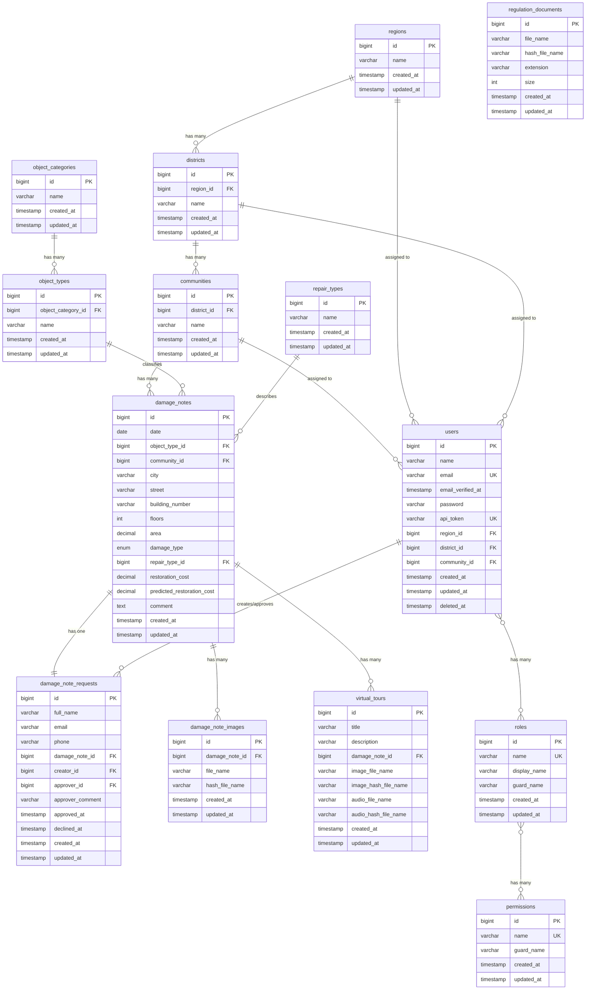

# Структура бази даних системи "Damage Map"

## 1. Загальні відомості

### 1.1. Характеристики бази даних

| Параметр | Значення |
|----------|----------|
| СУБД | MySQL 8.0 |
| Кодування | utf8mb4_unicode_ci |
| Движок таблиць | InnoDB |
| Підтримка транзакцій | Так |
| Зовнішні ключі | Так |

### 1.2. Огляд структури

База даних містить **21 таблицю**, які можна розділити на функціональні групи:

| Група | Таблиці | Призначення |
|-------|---------|-------------|
| Географічна ієрархія | `regions`, `districts`, `communities` | Адміністративно-територіальний устрій |
| Класифікація об'єктів | `object_categories`, `object_types`, `repair_types` | Довідники класифікації |
| Облік пошкоджень | `damage_notes`, `damage_note_requests`, `damage_note_images` | Основні дані про пошкодження |
| Управління доступом | `users`, `roles`, `permissions`, `model_has_roles`, `model_has_permissions`, `role_has_permissions` | Автентифікація та авторизація |
| Контент | `regulation_documents`, `virtual_tours` | Додатковий контент |
| Прогнозування | `inflation_indices` | Квартальні індекси інфляції для коригування вартості |
| Системні | `migrations`, `password_resets`, `personal_access_tokens` | Службові таблиці Laravel |

## 2. Діаграма зв'язків (ER-діаграма)



## 3. Детальний опис таблиць

### 3.1. Географічна ієрархія

#### 3.1.1. Таблиця `regions` (Регіони)

**Призначення:** Зберігання переліку областей України.

| Поле | Тип | Обмеження | Опис |
|------|-----|-----------|------|
| `id` | BIGINT UNSIGNED | PRIMARY KEY, AUTO_INCREMENT | Унікальний ідентифікатор |
| `name` | VARCHAR(255) | NOT NULL | Назва регіону |
| `created_at` | TIMESTAMP | NULL | Дата створення запису |
| `updated_at` | TIMESTAMP | NULL | Дата останньої модифікації |

**Індекси:**
- PRIMARY KEY (`id`)

**Кількість записів:** ~27 (області України + м. Київ)

---

#### 3.1.2. Таблиця `districts` (Райони)

**Призначення:** Зберігання переліку районів у межах регіонів.

| Поле | Тип | Обмеження | Опис |
|------|-----|-----------|------|
| `id` | BIGINT UNSIGNED | PRIMARY KEY, AUTO_INCREMENT | Унікальний ідентифікатор |
| `region_id` | BIGINT UNSIGNED | NOT NULL, FOREIGN KEY | Посилання на регіон |
| `name` | VARCHAR(255) | NOT NULL | Назва району |
| `created_at` | TIMESTAMP | NULL | Дата створення запису |
| `updated_at` | TIMESTAMP | NULL | Дата останньої модифікації |

**Індекси:**
- PRIMARY KEY (`id`)
- INDEX (`region_id`)

**Зовнішні ключі:**
| Поле | Посилання | ON DELETE | ON UPDATE |
|------|-----------|-----------|-----------|
| `region_id` | `regions(id)` | CASCADE | CASCADE |

**Кількість записів:** ~130 районів

---

#### 3.1.3. Таблиця `communities` (Територіальні громади)

**Призначення:** Зберігання переліку територіальних громад у межах районів.

| Поле | Тип | Обмеження | Опис |
|------|-----|-----------|------|
| `id` | BIGINT UNSIGNED | PRIMARY KEY, AUTO_INCREMENT | Унікальний ідентифікатор |
| `district_id` | BIGINT UNSIGNED | NOT NULL, FOREIGN KEY | Посилання на район |
| `name` | VARCHAR(255) | NOT NULL | Назва громади |
| `created_at` | TIMESTAMP | NULL | Дата створення запису |
| `updated_at` | TIMESTAMP | NULL | Дата останньої модифікації |

**Індекси:**
- PRIMARY KEY (`id`)
- INDEX (`district_id`)

**Зовнішні ключі:**
| Поле | Посилання | ON DELETE | ON UPDATE |
|------|-----------|-----------|-----------|
| `district_id` | `districts(id)` | CASCADE | CASCADE |

**Кількість записів:** ~1420 громад

---

### 3.2. Класифікація об'єктів

#### 3.2.1. Таблиця `object_categories` (Категорії об'єктів)

**Призначення:** Зберігання категорій пошкоджених об'єктів (верхній рівень класифікації).

| Поле | Тип | Обмеження | Опис |
|------|-----|-----------|------|
| `id` | BIGINT UNSIGNED | PRIMARY KEY, AUTO_INCREMENT | Унікальний ідентифікатор |
| `name` | VARCHAR(255) | NOT NULL | Назва категорії |
| `created_at` | TIMESTAMP | NULL | Дата створення запису |
| `updated_at` | TIMESTAMP | NULL | Дата останньої модифікації |

**Індекси:**
- PRIMARY KEY (`id`)

**Приклади даних:**
- Житлова нерухомість
- Соціальна інфраструктура
- Комунальна інфраструктура

---

#### 3.2.2. Таблиця `object_types` (Типи об'єктів)

**Призначення:** Зберігання конкретних типів об'єктів у межах категорій.

| Поле | Тип | Обмеження | Опис |
|------|-----|-----------|------|
| `id` | BIGINT UNSIGNED | PRIMARY KEY, AUTO_INCREMENT | Унікальний ідентифікатор |
| `object_category_id` | BIGINT UNSIGNED | NOT NULL, FOREIGN KEY | Посилання на категорію |
| `name` | VARCHAR(255) | NOT NULL | Назва типу об'єкта |
| `created_at` | TIMESTAMP | NULL | Дата створення запису |
| `updated_at` | TIMESTAMP | NULL | Дата останньої модифікації |

**Індекси:**
- PRIMARY KEY (`id`)
- INDEX (`object_category_id`)

**Зовнішні ключі:**
| Поле | Посилання | ON DELETE | ON UPDATE |
|------|-----------|-----------|-----------|
| `object_category_id` | `object_categories(id)` | CASCADE | CASCADE |

**Приклади даних:**
- Житловий будинок
- Школа
- Лікарня
- Адміністративна будівля

---

#### 3.2.3. Таблиця `repair_types` (Типи ремонту)

**Призначення:** Довідник видів ремонтних робіт.

| Поле | Тип | Обмеження | Опис |
|------|-----|-----------|------|
| `id` | BIGINT UNSIGNED | PRIMARY KEY, AUTO_INCREMENT | Унікальний ідентифікатор |
| `name` | VARCHAR(255) | NOT NULL | Назва типу ремонту |
| `created_at` | TIMESTAMP | NULL | Дата створення запису |
| `updated_at` | TIMESTAMP | NULL | Дата останньої модифікації |

**Індекси:**
- PRIMARY KEY (`id`)

**Приклади даних:**
- Поточний ремонт
- Капітальний ремонт
- Реконструкція

---

### 3.3. Облік пошкоджень

#### 3.3.1. Таблиця `damage_notes` (Записи про пошкодження)

**Призначення:** Центральна таблиця системи для зберігання інформації про пошкоджені об'єкти.

| Поле | Тип | Обмеження | Опис |
|------|-----|-----------|------|
| `id` | BIGINT UNSIGNED | PRIMARY KEY, AUTO_INCREMENT | Унікальний ідентифікатор |
| `date` | DATE | NOT NULL | Дата фіксації пошкодження |
| `object_type_id` | BIGINT UNSIGNED | NULL, FOREIGN KEY | Тип об'єкта |
| `community_id` | BIGINT UNSIGNED | NULL, FOREIGN KEY | Територіальна громада |
| `city` | VARCHAR(255) | NULL | Населений пункт |
| `street` | VARCHAR(255) | NULL | Вулиця |
| `building_number` | VARCHAR(255) | NULL | Номер будинку |
| `floors` | INT UNSIGNED | NULL | Кількість поверхів |
| `area` | DECIMAL(12,2) | NULL | Площа (м²) |
| `damage_type` | ENUM('low','medium','high') | NULL | Ступінь пошкодження |
| `repair_type_id` | BIGINT UNSIGNED | NULL, FOREIGN KEY | Тип ремонту |
| `restoration_cost` | DECIMAL(15,2) | NULL | Фактична вартість відновлення (грн) |
| `predicted_restoration_cost` | DECIMAL(15,2) | NULL | Прогнозована вартість (грн) |
| `comment` | TEXT | NULL | Додатковий коментар |
| `created_at` | TIMESTAMP | NULL | Дата створення запису |
| `updated_at` | TIMESTAMP | NULL | Дата останньої модифікації |

**Індекси:**
- PRIMARY KEY (`id`)
- INDEX (`object_type_id`)
- INDEX (`community_id`)
- INDEX (`repair_type_id`)

**Зовнішні ключі:**
| Поле | Посилання | ON DELETE | ON UPDATE |
|------|-----------|-----------|-----------|
| `object_type_id` | `object_types(id)` | SET NULL | CASCADE |
| `community_id` | `communities(id)` | SET NULL | CASCADE |
| `repair_type_id` | `repair_types(id)` | SET NULL | CASCADE |

**Значення ENUM `damage_type`:**
| Значення | Опис |
|----------|------|
| `low` | Легке пошкодження |
| `medium` | Середнє пошкодження |
| `high` | Тяжке пошкодження |

**Примітки:**
- Поля `restoration_cost` та `predicted_restoration_cost` дозволяють порівнювати фактичну та прогнозовану вартість
- Зовнішні ключі налаштовані на SET NULL при видаленні довідникових записів для збереження історичних даних

---

#### 3.3.2. Таблиця `damage_note_requests` (Заявки на внесення даних)

**Призначення:** Зберігання заявок від громадян та управління workflow схвалення.

| Поле | Тип | Обмеження | Опис |
|------|-----|-----------|------|
| `id` | BIGINT UNSIGNED | PRIMARY KEY, AUTO_INCREMENT | Унікальний ідентифікатор |
| `full_name` | VARCHAR(255) | NULL | ПІБ заявника |
| `email` | VARCHAR(255) | NULL | Email заявника |
| `phone` | VARCHAR(50) | NULL | Телефон заявника |
| `damage_note_id` | BIGINT UNSIGNED | NOT NULL, UNIQUE, FOREIGN KEY | Пов'язаний запис про пошкодження |
| `creator_id` | BIGINT UNSIGNED | NULL, FOREIGN KEY | Автор заявки (якщо авторизований) |
| `approver_id` | BIGINT UNSIGNED | NULL, FOREIGN KEY | Модератор, що розглянув заявку |
| `approver_comment` | VARCHAR(255) | NULL | Коментар модератора |
| `approved_at` | TIMESTAMP | NULL | Дата схвалення |
| `declined_at` | TIMESTAMP | NULL | Дата відхилення |
| `created_at` | TIMESTAMP | NULL | Дата створення запису |
| `updated_at` | TIMESTAMP | NULL | Дата останньої модифікації |

**Індекси:**
- PRIMARY KEY (`id`)
- UNIQUE (`damage_note_id`)
- INDEX (`creator_id`)
- INDEX (`approver_id`)

**Зовнішні ключі:**
| Поле | Посилання | ON DELETE | ON UPDATE |
|------|-----------|-----------|-----------|
| `damage_note_id` | `damage_notes(id)` | CASCADE | CASCADE |
| `creator_id` | `users(id)` | SET NULL | CASCADE |
| `approver_id` | `users(id)` | SET NULL | CASCADE |

**Логіка статусів:**
| Стан | Умова |
|------|-------|
| Очікує розгляду | `approved_at IS NULL AND declined_at IS NULL` |
| Схвалено | `approved_at IS NOT NULL` |
| Відхилено | `declined_at IS NOT NULL` |

---

#### 3.3.3. Таблиця `damage_note_images` (Зображення пошкоджень)

**Призначення:** Зберігання метаданих фотографій пошкоджених об'єктів.

| Поле | Тип | Обмеження | Опис |
|------|-----|-----------|------|
| `id` | BIGINT UNSIGNED | PRIMARY KEY, AUTO_INCREMENT | Унікальний ідентифікатор |
| `damage_note_id` | BIGINT UNSIGNED | NOT NULL, FOREIGN KEY | Пов'язаний запис про пошкодження |
| `file_name` | VARCHAR(255) | NOT NULL | Оригінальне ім'я файлу |
| `hash_file_name` | VARCHAR(255) | NOT NULL | Хешоване ім'я для зберігання |
| `created_at` | TIMESTAMP | NULL | Дата створення запису |
| `updated_at` | TIMESTAMP | NULL | Дата останньої модифікації |

**Індекси:**
- PRIMARY KEY (`id`)
- INDEX (`damage_note_id`)

**Зовнішні ключі:**
| Поле | Посилання | ON DELETE | ON UPDATE |
|------|-----------|-----------|-----------|
| `damage_note_id` | `damage_notes(id)` | CASCADE | CASCADE |

**Примітка:** Фактичні файли зберігаються в файловій системі, таблиця містить лише метадані.

---

### 3.4. Управління користувачами та доступом

#### 3.4.1. Таблиця `users` (Користувачі)

**Призначення:** Зберігання облікових записів користувачів системи.

| Поле | Тип | Обмеження | Опис |
|------|-----|-----------|------|
| `id` | BIGINT UNSIGNED | PRIMARY KEY, AUTO_INCREMENT | Унікальний ідентифікатор |
| `name` | VARCHAR(255) | NOT NULL | Ім'я користувача |
| `email` | VARCHAR(255) | NOT NULL, UNIQUE | Email (логін) |
| `email_verified_at` | TIMESTAMP | NULL | Дата підтвердження email |
| `password` | VARCHAR(255) | NOT NULL | Хеш пароля (bcrypt) |
| `api_token` | VARCHAR(255) | NULL, UNIQUE | API токен (legacy) |
| `region_id` | BIGINT UNSIGNED | NULL, FOREIGN KEY | Прив'язка до регіону |
| `district_id` | BIGINT UNSIGNED | NULL, FOREIGN KEY | Прив'язка до району |
| `community_id` | BIGINT UNSIGNED | NULL, FOREIGN KEY | Прив'язка до громади |
| `created_at` | TIMESTAMP | NULL | Дата створення запису |
| `updated_at` | TIMESTAMP | NULL | Дата останньої модифікації |
| `deleted_at` | TIMESTAMP | NULL | Дата soft delete |

**Індекси:**
- PRIMARY KEY (`id`)
- UNIQUE (`email`)
- UNIQUE (`api_token`)
- INDEX (`region_id`)
- INDEX (`district_id`)
- INDEX (`community_id`)

**Зовнішні ключі:**
| Поле | Посилання | ON DELETE | ON UPDATE |
|------|-----------|-----------|-----------|
| `region_id` | `regions(id)` | SET NULL | CASCADE |
| `district_id` | `districts(id)` | SET NULL | CASCADE |
| `community_id` | `communities(id)` | SET NULL | CASCADE |

**Особливості:**
- Підтримує Soft Delete (`deleted_at`)
- Територіальні поля визначають область відповідальності адміністратора

---

#### 3.4.2. Таблиця `roles` (Ролі)

**Призначення:** Зберігання ролей користувачів (Spatie Laravel Permission).

| Поле | Тип | Обмеження | Опис |
|------|-----|-----------|------|
| `id` | BIGINT UNSIGNED | PRIMARY KEY, AUTO_INCREMENT | Унікальний ідентифікатор |
| `name` | VARCHAR(125) | NOT NULL | Системна назва ролі |
| `display_name` | VARCHAR(125) | NOT NULL | Відображувана назва |
| `guard_name` | VARCHAR(125) | NOT NULL | Guard (api/web) |
| `created_at` | TIMESTAMP | NULL | Дата створення запису |
| `updated_at` | TIMESTAMP | NULL | Дата останньої модифікації |

**Індекси:**
- PRIMARY KEY (`id`)
- UNIQUE (`name`, `guard_name`)

**Поточні ролі:**
| name | display_name | Опис |
|------|--------------|------|
| `super_admin` | Суперадміністратор | Повний доступ до системи |
| `admin` | Адміністратор | Управління даними в межах території |
| `analyst` | Аналітик | Перегляд даних |

---

#### 3.4.3. Таблиця `permissions` (Дозволи)

**Призначення:** Зберігання дозволів для гранулярного контролю доступу.

| Поле | Тип | Обмеження | Опис |
|------|-----|-----------|------|
| `id` | BIGINT UNSIGNED | PRIMARY KEY, AUTO_INCREMENT | Унікальний ідентифікатор |
| `name` | VARCHAR(125) | NOT NULL | Системна назва дозволу |
| `guard_name` | VARCHAR(125) | NOT NULL | Guard (api/web) |
| `created_at` | TIMESTAMP | NULL | Дата створення запису |
| `updated_at` | TIMESTAMP | NULL | Дата останньої модифікації |

**Індекси:**
- PRIMARY KEY (`id`)
- UNIQUE (`name`, `guard_name`)

---

#### 3.4.4. Таблиця `model_has_roles` (Зв'язок моделей з ролями)

**Призначення:** Поліморфний зв'язок користувачів з ролями.

| Поле | Тип | Обмеження | Опис |
|------|-----|-----------|------|
| `role_id` | BIGINT UNSIGNED | PRIMARY KEY (partial), FOREIGN KEY | ID ролі |
| `model_type` | VARCHAR(255) | PRIMARY KEY (partial) | Тип моделі (App\Models\User) |
| `model_id` | BIGINT UNSIGNED | PRIMARY KEY (partial) | ID моделі |

**Індекси:**
- PRIMARY KEY (`role_id`, `model_id`, `model_type`)
- INDEX (`model_id`, `model_type`)

**Зовнішні ключі:**
| Поле | Посилання | ON DELETE |
|------|-----------|-----------|
| `role_id` | `roles(id)` | CASCADE |

---

#### 3.4.5. Таблиця `model_has_permissions` (Зв'язок моделей з дозволами)

**Призначення:** Пряме призначення дозволів моделям.

| Поле | Тип | Обмеження | Опис |
|------|-----|-----------|------|
| `permission_id` | BIGINT UNSIGNED | PRIMARY KEY (partial), FOREIGN KEY | ID дозволу |
| `model_type` | VARCHAR(255) | PRIMARY KEY (partial) | Тип моделі |
| `model_id` | BIGINT UNSIGNED | PRIMARY KEY (partial) | ID моделі |

**Індекси:**
- PRIMARY KEY (`permission_id`, `model_id`, `model_type`)
- INDEX (`model_id`, `model_type`)

**Зовнішні ключі:**
| Поле | Посилання | ON DELETE |
|------|-----------|-----------|
| `permission_id` | `permissions(id)` | CASCADE |

---

#### 3.4.6. Таблиця `role_has_permissions` (Зв'язок ролей з дозволами)

**Призначення:** Призначення дозволів ролям.

| Поле | Тип | Обмеження | Опис |
|------|-----|-----------|------|
| `permission_id` | BIGINT UNSIGNED | PRIMARY KEY (partial), FOREIGN KEY | ID дозволу |
| `role_id` | BIGINT UNSIGNED | PRIMARY KEY (partial), FOREIGN KEY | ID ролі |

**Індекси:**
- PRIMARY KEY (`permission_id`, `role_id`)
- INDEX (`role_id`)

**Зовнішні ключі:**
| Поле | Посилання | ON DELETE |
|------|-----------|-----------|
| `permission_id` | `permissions(id)` | CASCADE |
| `role_id` | `roles(id)` | CASCADE |

---

### 3.5. Контент

#### 3.5.1. Таблиця `regulation_documents` (Нормативні документи)

**Призначення:** Зберігання метаданих завантажених нормативних актів.

| Поле | Тип | Обмеження | Опис |
|------|-----|-----------|------|
| `id` | BIGINT UNSIGNED | PRIMARY KEY, AUTO_INCREMENT | Унікальний ідентифікатор |
| `file_name` | VARCHAR(255) | NOT NULL | Оригінальне ім'я файлу |
| `hash_file_name` | VARCHAR(255) | NOT NULL | Хешоване ім'я для зберігання |
| `extension` | VARCHAR(50) | NOT NULL | Розширення файлу (pdf) |
| `size` | INT | NOT NULL | Розмір файлу (байт) |
| `created_at` | TIMESTAMP | NULL | Дата створення запису |
| `updated_at` | TIMESTAMP | NULL | Дата останньої модифікації |

**Індекси:**
- PRIMARY KEY (`id`)

---

#### 3.5.2. Таблиця `virtual_tours` (Віртуальні тури)

**Призначення:** Зберігання віртуальних турів з мультимедійним контентом.

| Поле | Тип | Обмеження | Опис |
|------|-----|-----------|------|
| `id` | BIGINT UNSIGNED | PRIMARY KEY, AUTO_INCREMENT | Унікальний ідентифікатор |
| `title` | VARCHAR(255) | NOT NULL | Назва туру |
| `description` | VARCHAR(255) | NULL | Опис туру |
| `damage_note_id` | BIGINT UNSIGNED | NULL, FOREIGN KEY | Пов'язаний запис про пошкодження |
| `image_file_name` | VARCHAR(255) | NULL | Оригінальне ім'я зображення |
| `image_hash_file_name` | VARCHAR(255) | NULL | Хешоване ім'я зображення |
| `audio_file_name` | VARCHAR(255) | NULL | Оригінальне ім'я аудіо |
| `audio_hash_file_name` | VARCHAR(255) | NULL | Хешоване ім'я аудіо |
| `created_at` | TIMESTAMP | NULL | Дата створення запису |
| `updated_at` | TIMESTAMP | NULL | Дата останньої модифікації |

**Індекси:**
- PRIMARY KEY (`id`)
- INDEX (`damage_note_id`)

**Зовнішні ключі:**
| Поле | Посилання | ON DELETE | ON UPDATE |
|------|-----------|-----------|-----------|
| `damage_note_id` | `damage_notes(id)` | CASCADE | CASCADE |

---

### 3.6. Прогнозування

#### 3.6.1. Таблиця `inflation_indices` (Індекси інфляції)

**Призначення:** Зберігання місячних коефіцієнтів інфляції для коригування прогнозованої вартості відновлення. Базовий місяць — 2024-01 = 1.0000.

Laravel зчитує всі записи таблиці методом `InflationIndex::getAllForPayload()` та передає їх у кожному payload до Flask (поле `inflation_indices`). Flask використовує ці значення замість власного вбудованого словника, що дозволяє адміністратору оновлювати коефіцієнти в БД і негайно впливати на розрахунки без перезапуску мікросервісу. Результат `getAllForPayload()` кешується на 60 хвилин під ключем `inflation_indices_payload`; при оновленні записів кеш інвалідується через `Cache::forget('inflation_indices_payload')`. Таблиця також відображається у UI через `GET /api/inflation-indices`.

| Поле | Тип | Обмеження | Опис |
|------|-----|-----------|------|
| `id` | BIGINT UNSIGNED | PRIMARY KEY, AUTO_INCREMENT | Унікальний ідентифікатор |
| `year` | SMALLINT UNSIGNED | NOT NULL | Рік |
| `month` | TINYINT UNSIGNED | NOT NULL | Місяць: 1–12 |
| `index_value` | DECIMAL(6,4) | NOT NULL | Коефіцієнт відносно базового місяця (2024-01) |
| `source_type` | ENUM('official','forecast','extrapolated') | NOT NULL, DEFAULT 'forecast' | Тип джерела |
| `source_description` | VARCHAR(500) | NULL | Опис джерела даних |
| `created_at` | TIMESTAMP | NULL | Дата створення запису |
| `updated_at` | TIMESTAMP | NULL | Дата останньої модифікації |

**Індекси:**
- PRIMARY KEY (`id`)
- UNIQUE (`year`, `month`)

**Заповнені дані:** 2022–2027, 12 місяців на рік (72 записи).

| `source_type` | Роки | Опис |
|---------------|------|------|
| `official` | 2022–2024 | Дані Держстату України, форма №621 |
| `forecast` | 2025–2027 | Прогноз НБУ |

---

### 3.7. Системні таблиці

#### 3.7.1. Таблиця `migrations`

**Призначення:** Відстеження виконаних міграцій Laravel.

| Поле | Тип | Обмеження | Опис |
|------|-----|-----------|------|
| `id` | INT UNSIGNED | PRIMARY KEY, AUTO_INCREMENT | Унікальний ідентифікатор |
| `migration` | VARCHAR(255) | NOT NULL | Назва файлу міграції |
| `batch` | INT | NOT NULL | Номер пакету виконання |

---

#### 3.7.2. Таблиця `password_resets`

**Призначення:** Токени для скидання паролів.

| Поле | Тип | Обмеження | Опис |
|------|-----|-----------|------|
| `email` | VARCHAR(255) | NOT NULL, INDEX | Email користувача |
| `token` | VARCHAR(255) | NOT NULL | Токен скидання |
| `created_at` | TIMESTAMP | NULL | Дата створення |

---

#### 3.7.3. Таблиця `personal_access_tokens`

**Призначення:** API токени Laravel Sanctum.

| Поле | Тип | Обмеження | Опис |
|------|-----|-----------|------|
| `id` | BIGINT UNSIGNED | PRIMARY KEY, AUTO_INCREMENT | Унікальний ідентифікатор |
| `tokenable_type` | VARCHAR(255) | NOT NULL | Тип моделі |
| `tokenable_id` | BIGINT UNSIGNED | NOT NULL | ID моделі |
| `name` | VARCHAR(255) | NOT NULL | Назва токена |
| `token` | VARCHAR(64) | NOT NULL, UNIQUE | Хеш токена |
| `abilities` | TEXT | NULL | Дозволи токена (JSON) |
| `last_used_at` | TIMESTAMP | NULL | Останнє використання |
| `created_at` | TIMESTAMP | NULL | Дата створення |
| `updated_at` | TIMESTAMP | NULL | Дата модифікації |

**Індекси:**
- PRIMARY KEY (`id`)
- UNIQUE (`token`)
- INDEX (`tokenable_type`, `tokenable_id`)

---

## 4. Ключові зв'язки між сутностями

### 4.1. Географічна ієрархія

```
Region (1) ──────< District (N)
District (1) ────< Community (N)
```

**Характеристика:** Каскадне видалення — при видаленні регіону видаляються всі пов'язані райони та громади.

### 4.2. Класифікація об'єктів

```
ObjectCategory (1) ──────< ObjectType (N)
ObjectType (1) ──────────< DamageNote (N)
RepairType (1) ──────────< DamageNote (N)
```

**Характеристика:** При видаленні типу об'єкта або типу ремонту відповідні поля в `damage_notes` встановлюються в NULL.

### 4.3. Облік пошкоджень

```
Community (1) ─────< DamageNote (N)
DamageNote (1) ────< DamageNoteImage (N)
DamageNote (1) ────o DamageNoteRequest (1)  [UNIQUE]
DamageNote (1) ────< VirtualTour (N)
```

**Характеристика:**
- Запис про пошкодження має рівно одну заявку (1:1)
- Може мати багато зображень та віртуальних турів
- Каскадне видалення для всіх пов'язаних записів

### 4.4. Управління доступом

```
User (N) >────────< Role (M)        [через model_has_roles]
Role (N) >────────< Permission (M)  [через role_has_permissions]
User (N) >────────< Permission (M)  [через model_has_permissions]
```

**Характеристика:** Поліморфна реалізація через Spatie Laravel Permission.

### 4.5. Територіальна прив'язка користувачів

```
Region (1) ──────< User (N)
District (1) ────< User (N)
Community (1) ───< User (N)
```

**Характеристика:** Визначає область відповідальності адміністратора.

---

## 5. Індекси та оптимізація

### 5.1. Первинні ключі

Всі таблиці використовують AUTO_INCREMENT BIGINT UNSIGNED для первинних ключів, що забезпечує:
- Унікальність ідентифікаторів
- Ефективну індексацію
- Підтримку великої кількості записів

### 5.2. Зовнішні ключі

Всі зовнішні ключі мають відповідні індекси для оптимізації JOIN-операцій.

### 5.3. Унікальні обмеження

| Таблиця | Поле(я) | Призначення |
|---------|---------|-------------|
| `users` | `email` | Унікальність email |
| `users` | `api_token` | Унікальність токена |
| `damage_note_requests` | `damage_note_id` | Одна заявка на запис |
| `roles` | `name`, `guard_name` | Унікальність ролі |
| `permissions` | `name`, `guard_name` | Унікальність дозволу |
| `inflation_indices` | `year`, `month` | Один запис на місяць |

---

## 6. Висновки

Структура бази даних системи "Damage Map" характеризується:

1. **Нормалізацією** — дані розділені на логічні таблиці з мінімальним дублюванням
2. **Референційною цілісністю** — зовнішні ключі забезпечують консистентність даних
3. **Гнучкістю** — nullable поля дозволяють поступове заповнення даних
4. **Масштабованістю** — BIGINT ідентифікатори та індекси підтримують зростання даних
5. **Безпекою** — підтримка Soft Delete для користувачів та розділення прав доступу

Схема бази даних відповідає вимогам предметної області та забезпечує ефективну роботу системи обліку пошкоджень інфраструктури.
